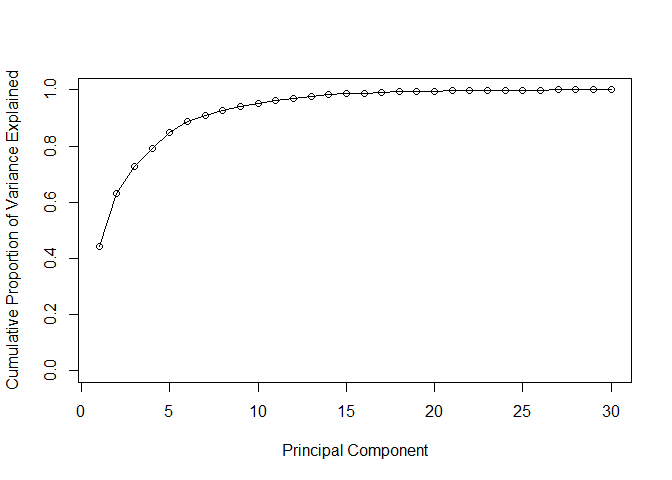
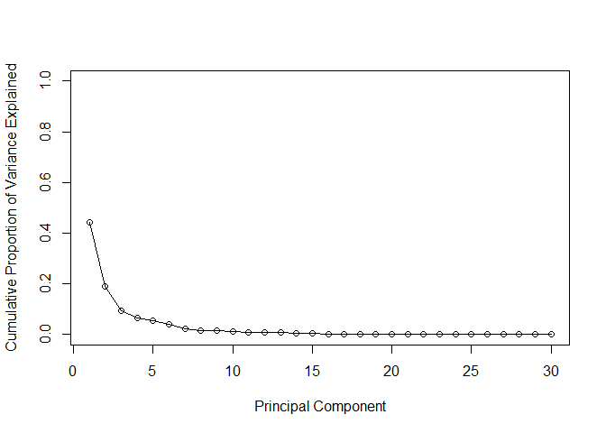
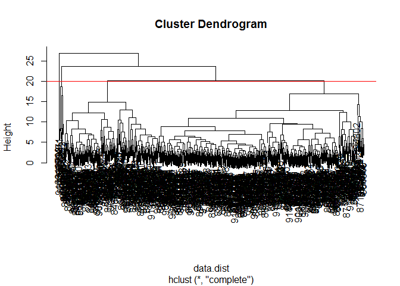
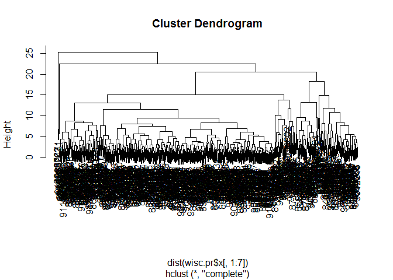

```r
# Complete the following code to input the data and store as wisc.df
wisc.df <- read.csv("https://bioboot.github.io/bimm143_W18/class-material/WisconsinCancer.csv")
head(wisc.df)
```

```
##         id diagnosis radius_mean texture_mean perimeter_mean area_mean
## 1   842302         M       17.99        10.38         122.80    1001.0
## 2   842517         M       20.57        17.77         132.90    1326.0
## 3 84300903         M       19.69        21.25         130.00    1203.0
## 4 84348301         M       11.42        20.38          77.58     386.1
## 5 84358402         M       20.29        14.34         135.10    1297.0
## 6   843786         M       12.45        15.70          82.57     477.1
##   smoothness_mean compactness_mean concavity_mean concave.points_mean
## 1         0.11840          0.27760         0.3001             0.14710
## 2         0.08474          0.07864         0.0869             0.07017
## 3         0.10960          0.15990         0.1974             0.12790
## 4         0.14250          0.28390         0.2414             0.10520
## 5         0.10030          0.13280         0.1980             0.10430
## 6         0.12780          0.17000         0.1578             0.08089
##   symmetry_mean fractal_dimension_mean radius_se texture_se perimeter_se
## 1        0.2419                0.07871    1.0950     0.9053        8.589
## 2        0.1812                0.05667    0.5435     0.7339        3.398
## 3        0.2069                0.05999    0.7456     0.7869        4.585
## 4        0.2597                0.09744    0.4956     1.1560        3.445
## 5        0.1809                0.05883    0.7572     0.7813        5.438
## 6        0.2087                0.07613    0.3345     0.8902        2.217
##   area_se smoothness_se compactness_se concavity_se concave.points_se
## 1  153.40      0.006399        0.04904      0.05373           0.01587
## 2   74.08      0.005225        0.01308      0.01860           0.01340
## 3   94.03      0.006150        0.04006      0.03832           0.02058
## 4   27.23      0.009110        0.07458      0.05661           0.01867
## 5   94.44      0.011490        0.02461      0.05688           0.01885
## 6   27.19      0.007510        0.03345      0.03672           0.01137
##   symmetry_se fractal_dimension_se radius_worst texture_worst
## 1     0.03003             0.006193        25.38         17.33
## 2     0.01389             0.003532        24.99         23.41
## 3     0.02250             0.004571        23.57         25.53
## 4     0.05963             0.009208        14.91         26.50
## 5     0.01756             0.005115        22.54         16.67
## 6     0.02165             0.005082        15.47         23.75
##   perimeter_worst area_worst smoothness_worst compactness_worst
## 1          184.60     2019.0           0.1622            0.6656
## 2          158.80     1956.0           0.1238            0.1866
## 3          152.50     1709.0           0.1444            0.4245
## 4           98.87      567.7           0.2098            0.8663
## 5          152.20     1575.0           0.1374            0.2050
## 6          103.40      741.6           0.1791            0.5249
##   concavity_worst concave.points_worst symmetry_worst
## 1          0.7119               0.2654         0.4601
## 2          0.2416               0.1860         0.2750
## 3          0.4504               0.2430         0.3613
## 4          0.6869               0.2575         0.6638
## 5          0.4000               0.1625         0.2364
## 6          0.5355               0.1741         0.3985
##   fractal_dimension_worst  X
## 1                 0.11890 NA
## 2                 0.08902 NA
## 3                 0.08758 NA
## 4                 0.17300 NA
## 5                 0.07678 NA
## 6                 0.12440 NA
```


```r
#how many M's
table(wisc.df$diagnosis)
```

```
## 
##   B   M 
## 357 212
```

make a numeric classification vector

```r
diagnosis <- as.numeric(wisc.df$diagnosis == "M")
table(diagnosis)
```

```
## diagnosis
##   0   1 
## 357 212
```


```r
# Convert the features of the data: wisc.data
wisc.data <- as.matrix( wisc.df[,3:ncol(wisc.df)])
rownames(wisc.data) <- wisc.df$id
head(wisc.data)
```

```
##          radius_mean texture_mean perimeter_mean area_mean smoothness_mean
## 842302         17.99        10.38         122.80    1001.0         0.11840
## 842517         20.57        17.77         132.90    1326.0         0.08474
## 84300903       19.69        21.25         130.00    1203.0         0.10960
## 84348301       11.42        20.38          77.58     386.1         0.14250
## 84358402       20.29        14.34         135.10    1297.0         0.10030
## 843786         12.45        15.70          82.57     477.1         0.12780
##          compactness_mean concavity_mean concave.points_mean symmetry_mean
## 842302            0.27760         0.3001             0.14710        0.2419
## 842517            0.07864         0.0869             0.07017        0.1812
## 84300903          0.15990         0.1974             0.12790        0.2069
## 84348301          0.28390         0.2414             0.10520        0.2597
## 84358402          0.13280         0.1980             0.10430        0.1809
## 843786            0.17000         0.1578             0.08089        0.2087
##          fractal_dimension_mean radius_se texture_se perimeter_se area_se
## 842302                  0.07871    1.0950     0.9053        8.589  153.40
## 842517                  0.05667    0.5435     0.7339        3.398   74.08
## 84300903                0.05999    0.7456     0.7869        4.585   94.03
## 84348301                0.09744    0.4956     1.1560        3.445   27.23
## 84358402                0.05883    0.7572     0.7813        5.438   94.44
## 843786                  0.07613    0.3345     0.8902        2.217   27.19
##          smoothness_se compactness_se concavity_se concave.points_se
## 842302        0.006399        0.04904      0.05373           0.01587
## 842517        0.005225        0.01308      0.01860           0.01340
## 84300903      0.006150        0.04006      0.03832           0.02058
## 84348301      0.009110        0.07458      0.05661           0.01867
## 84358402      0.011490        0.02461      0.05688           0.01885
## 843786        0.007510        0.03345      0.03672           0.01137
##          symmetry_se fractal_dimension_se radius_worst texture_worst
## 842302       0.03003             0.006193        25.38         17.33
## 842517       0.01389             0.003532        24.99         23.41
## 84300903     0.02250             0.004571        23.57         25.53
## 84348301     0.05963             0.009208        14.91         26.50
## 84358402     0.01756             0.005115        22.54         16.67
## 843786       0.02165             0.005082        15.47         23.75
##          perimeter_worst area_worst smoothness_worst compactness_worst
## 842302            184.60     2019.0           0.1622            0.6656
## 842517            158.80     1956.0           0.1238            0.1866
## 84300903          152.50     1709.0           0.1444            0.4245
## 84348301           98.87      567.7           0.2098            0.8663
## 84358402          152.20     1575.0           0.1374            0.2050
## 843786            103.40      741.6           0.1791            0.5249
##          concavity_worst concave.points_worst symmetry_worst
## 842302            0.7119               0.2654         0.4601
## 842517            0.2416               0.1860         0.2750
## 84300903          0.4504               0.2430         0.3613
## 84348301          0.6869               0.2575         0.6638
## 84358402          0.4000               0.1625         0.2364
## 843786            0.5355               0.1741         0.3985
##          fractal_dimension_worst  X
## 842302                   0.11890 NA
## 842517                   0.08902 NA
## 84300903                 0.08758 NA
## 84348301                 0.17300 NA
## 84358402                 0.07678 NA
## 843786                   0.12440 NA
```

```r
wisc.data <- wisc.data[,-31]
head(wisc.data)
```

```
##          radius_mean texture_mean perimeter_mean area_mean smoothness_mean
## 842302         17.99        10.38         122.80    1001.0         0.11840
## 842517         20.57        17.77         132.90    1326.0         0.08474
## 84300903       19.69        21.25         130.00    1203.0         0.10960
## 84348301       11.42        20.38          77.58     386.1         0.14250
## 84358402       20.29        14.34         135.10    1297.0         0.10030
## 843786         12.45        15.70          82.57     477.1         0.12780
##          compactness_mean concavity_mean concave.points_mean symmetry_mean
## 842302            0.27760         0.3001             0.14710        0.2419
## 842517            0.07864         0.0869             0.07017        0.1812
## 84300903          0.15990         0.1974             0.12790        0.2069
## 84348301          0.28390         0.2414             0.10520        0.2597
## 84358402          0.13280         0.1980             0.10430        0.1809
## 843786            0.17000         0.1578             0.08089        0.2087
##          fractal_dimension_mean radius_se texture_se perimeter_se area_se
## 842302                  0.07871    1.0950     0.9053        8.589  153.40
## 842517                  0.05667    0.5435     0.7339        3.398   74.08
## 84300903                0.05999    0.7456     0.7869        4.585   94.03
## 84348301                0.09744    0.4956     1.1560        3.445   27.23
## 84358402                0.05883    0.7572     0.7813        5.438   94.44
## 843786                  0.07613    0.3345     0.8902        2.217   27.19
##          smoothness_se compactness_se concavity_se concave.points_se
## 842302        0.006399        0.04904      0.05373           0.01587
## 842517        0.005225        0.01308      0.01860           0.01340
## 84300903      0.006150        0.04006      0.03832           0.02058
## 84348301      0.009110        0.07458      0.05661           0.01867
## 84358402      0.011490        0.02461      0.05688           0.01885
## 843786        0.007510        0.03345      0.03672           0.01137
##          symmetry_se fractal_dimension_se radius_worst texture_worst
## 842302       0.03003             0.006193        25.38         17.33
## 842517       0.01389             0.003532        24.99         23.41
## 84300903     0.02250             0.004571        23.57         25.53
## 84348301     0.05963             0.009208        14.91         26.50
## 84358402     0.01756             0.005115        22.54         16.67
## 843786       0.02165             0.005082        15.47         23.75
##          perimeter_worst area_worst smoothness_worst compactness_worst
## 842302            184.60     2019.0           0.1622            0.6656
## 842517            158.80     1956.0           0.1238            0.1866
## 84300903          152.50     1709.0           0.1444            0.4245
## 84348301           98.87      567.7           0.2098            0.8663
## 84358402          152.20     1575.0           0.1374            0.2050
## 843786            103.40      741.6           0.1791            0.5249
##          concavity_worst concave.points_worst symmetry_worst
## 842302            0.7119               0.2654         0.4601
## 842517            0.2416               0.1860         0.2750
## 84300903          0.4504               0.2430         0.3613
## 84348301          0.6869               0.2575         0.6638
## 84358402          0.4000               0.1625         0.2364
## 843786            0.5355               0.1741         0.3985
##          fractal_dimension_worst
## 842302                   0.11890
## 842517                   0.08902
## 84300903                 0.08758
## 84348301                 0.17300
## 84358402                 0.07678
## 843786                   0.12440
```

## Exporatory data analysis
The functions dim(), length(), grep() and sum() may be useful for answering the first 3 questions above.

**Q1**. How many observations are in this dataset?

```r
nrow(wisc.data)
```

```
## [1] 569
```

**Q2**. How many variables/features in the data are suffixed with _mean?

```r
# return things with the word mean in them
grep("mean", colnames(wisc.data), value = TRUE)
```

```
##  [1] "radius_mean"            "texture_mean"          
##  [3] "perimeter_mean"         "area_mean"             
##  [5] "smoothness_mean"        "compactness_mean"      
##  [7] "concavity_mean"         "concave.points_mean"   
##  [9] "symmetry_mean"          "fractal_dimension_mean"
```

```r
# return the position (ie index) of things with mean in them
grep("mean", colnames(wisc.data), value = FALSE) #default
```

```
##  [1]  1  2  3  4  5  6  7  8  9 10
```

```r
#return things the DONT have the word mean in them
grep("mean", colnames(wisc.data), value = TRUE, invert = TRUE)
```

```
##  [1] "radius_se"               "texture_se"             
##  [3] "perimeter_se"            "area_se"                
##  [5] "smoothness_se"           "compactness_se"         
##  [7] "concavity_se"            "concave.points_se"      
##  [9] "symmetry_se"             "fractal_dimension_se"   
## [11] "radius_worst"            "texture_worst"          
## [13] "perimeter_worst"         "area_worst"             
## [15] "smoothness_worst"        "compactness_worst"      
## [17] "concavity_worst"         "concave.points_worst"   
## [19] "symmetry_worst"          "fractal_dimension_worst"
```

```r
length( grep("mean", colnames(wisc.data)))
```

```
## [1] 10
```


**Q3**. How many of the observations have a malignant diagnosis?

```r
sum(diagnosis)
```

```
## [1] 212
```

## Section 2 PCA

```r
# Check column means and standard deviations
colMeans(wisc.data)
```

```
##             radius_mean            texture_mean          perimeter_mean 
##            1.412729e+01            1.928965e+01            9.196903e+01 
##               area_mean         smoothness_mean        compactness_mean 
##            6.548891e+02            9.636028e-02            1.043410e-01 
##          concavity_mean     concave.points_mean           symmetry_mean 
##            8.879932e-02            4.891915e-02            1.811619e-01 
##  fractal_dimension_mean               radius_se              texture_se 
##            6.279761e-02            4.051721e-01            1.216853e+00 
##            perimeter_se                 area_se           smoothness_se 
##            2.866059e+00            4.033708e+01            7.040979e-03 
##          compactness_se            concavity_se       concave.points_se 
##            2.547814e-02            3.189372e-02            1.179614e-02 
##             symmetry_se    fractal_dimension_se            radius_worst 
##            2.054230e-02            3.794904e-03            1.626919e+01 
##           texture_worst         perimeter_worst              area_worst 
##            2.567722e+01            1.072612e+02            8.805831e+02 
##        smoothness_worst       compactness_worst         concavity_worst 
##            1.323686e-01            2.542650e-01            2.721885e-01 
##    concave.points_worst          symmetry_worst fractal_dimension_worst 
##            1.146062e-01            2.900756e-01            8.394582e-02
```

```r
apply(wisc.data,2,sd)
```

```
##             radius_mean            texture_mean          perimeter_mean 
##            3.524049e+00            4.301036e+00            2.429898e+01 
##               area_mean         smoothness_mean        compactness_mean 
##            3.519141e+02            1.406413e-02            5.281276e-02 
##          concavity_mean     concave.points_mean           symmetry_mean 
##            7.971981e-02            3.880284e-02            2.741428e-02 
##  fractal_dimension_mean               radius_se              texture_se 
##            7.060363e-03            2.773127e-01            5.516484e-01 
##            perimeter_se                 area_se           smoothness_se 
##            2.021855e+00            4.549101e+01            3.002518e-03 
##          compactness_se            concavity_se       concave.points_se 
##            1.790818e-02            3.018606e-02            6.170285e-03 
##             symmetry_se    fractal_dimension_se            radius_worst 
##            8.266372e-03            2.646071e-03            4.833242e+00 
##           texture_worst         perimeter_worst              area_worst 
##            6.146258e+00            3.360254e+01            5.693570e+02 
##        smoothness_worst       compactness_worst         concavity_worst 
##            2.283243e-02            1.573365e-01            2.086243e-01 
##    concave.points_worst          symmetry_worst fractal_dimension_worst 
##            6.573234e-02            6.186747e-02            1.806127e-02
```

demo the minus use for extracting posititons/cols/rows etc

```r
x <- c("barry", "chris", "mary", "chandra")
x[-c(1:3)]
```

```
## [1] "chandra"
```


```r
# Perform PCA on wisc.data by completing the following code
wisc.pr <- prcomp( wisc.data, scale=TRUE)
```


```r
# Look at summary of results
summary(wisc.pr)
```

```
## Importance of components:
##                           PC1    PC2     PC3     PC4     PC5     PC6
## Standard deviation     3.6444 2.3857 1.67867 1.40735 1.28403 1.09880
## Proportion of Variance 0.4427 0.1897 0.09393 0.06602 0.05496 0.04025
## Cumulative Proportion  0.4427 0.6324 0.72636 0.79239 0.84734 0.88759
##                            PC7     PC8    PC9    PC10   PC11    PC12
## Standard deviation     0.82172 0.69037 0.6457 0.59219 0.5421 0.51104
## Proportion of Variance 0.02251 0.01589 0.0139 0.01169 0.0098 0.00871
## Cumulative Proportion  0.91010 0.92598 0.9399 0.95157 0.9614 0.97007
##                           PC13    PC14    PC15    PC16    PC17    PC18
## Standard deviation     0.49128 0.39624 0.30681 0.28260 0.24372 0.22939
## Proportion of Variance 0.00805 0.00523 0.00314 0.00266 0.00198 0.00175
## Cumulative Proportion  0.97812 0.98335 0.98649 0.98915 0.99113 0.99288
##                           PC19    PC20   PC21    PC22    PC23   PC24
## Standard deviation     0.22244 0.17652 0.1731 0.16565 0.15602 0.1344
## Proportion of Variance 0.00165 0.00104 0.0010 0.00091 0.00081 0.0006
## Cumulative Proportion  0.99453 0.99557 0.9966 0.99749 0.99830 0.9989
##                           PC25    PC26    PC27    PC28    PC29    PC30
## Standard deviation     0.12442 0.09043 0.08307 0.03987 0.02736 0.01153
## Proportion of Variance 0.00052 0.00027 0.00023 0.00005 0.00002 0.00000
## Cumulative Proportion  0.99942 0.99969 0.99992 0.99997 1.00000 1.00000
```

**Q4**. From your results, what proportion of the original variance is captured by the first principal components (PC1)?
    0.4427
    
**Q5**. How many principal components (PCs) are required to describe at least 70% of the original variance in the data?
    3 PCs (count cumulative proportion)
    
**Q6**. How many principal components (PCs) are required to describe at least 90% of the original variance in the data?
   7 PCs
   
   
   ## Section 3, interpreting PCA results

```r
attributes(wisc.pr)
```

```
## $names
## [1] "sdev"     "rotation" "center"   "scale"    "x"       
## 
## $class
## [1] "prcomp"
```

   

```r
#Create a biplot of the wisc.pr using the biplot() function.
biplot(wisc.pr)
```

<!-- -->
**Q7**. What stands out to you about this plot? Is it easy or difficult to understand? Why?
Data is too big, it's a bad,messy plot

```r
# Scatter plot observations by components 1 and 2
plot( wisc.pr$x[,1], wisc.pr$x[,2] , col = diagnosis+1, 
     xlab = "PC1", ylab = "PC2")
```

<!-- -->

**Q**8. Repeat the same for principal components 1 and 3. What do you notice about these plots?

```r
# Scatter plot observations by components 1 and 3
plot(wisc.pr$x[, c(1, 3)], col = (diagnosis + 1), 
     xlab = "PC1", ylab = "PC3")
```

<!-- -->
same coordinate on the PC1 axis, but the y axis has flipped, it was high up the y axis on pc2 and ,low on the y axis for pc3


#scree plot

##varicance explained scree plot 

```r
pr.var <- wisc.pr$sdev^2
head(pr.var)
```

```
## [1] 13.281608  5.691355  2.817949  1.980640  1.648731  1.207357
```


```r
#proportion of variance
pve <- pr.var / sum(pr.var)
```


```r
# Plot cumulative proportion of variance explained
plot( cumsum(pve), xlab = "Principal Component", 
     ylab = "Cumulative Proportion of Variance Explained", 
     ylim = c(0, 1), type = "o")
```

<!-- -->


```r
#calculate variance of each component
pr.var <- wisc.pr$sdev^2


# plot varicane explained 
```

#barplot

```r
plot(pve , xlab = "Principal Component", 
     ylab = "Cumulative Proportion of Variance Explained", 
     ylim = c(0, 1), type = "o")
```

<!-- -->


```r
# Alternative scree plot of the same data, note data driven y-axis
barplot(pve, ylab = "Precent of Variance Explained",
     names.arg=paste0("PC",1:length(pve)), las=2, axes = FALSE)
axis(2, at=pve, labels=round(pve,2)*100 )
```

<!-- -->

## Section 3 selecting numbers of clusters
hierarchail custering


```r
#?hclust
#?dist

#scale the wisc.data data : data.scaled
data.scaled <- scale(wisc.data)

#calculate distance matrix needed for hclust
data.dist <- dist(data.scaled)

#
wisc.hclust <- hclust(data.dist)
```

plot our hclust model tree

```r
plot(wisc.hclust)
abline(h=20, col="red")
```

<!-- -->

```r
wisc.hclust.clusters <- cutree(wisc.hclust, h=20)

#or
#wisc.hclust <- cutree(wisc.hclsut, k = 4)
```


```r
table(wisc.hclust.clusters)
```

```
## wisc.hclust.clusters
##   1   2   3   4 
## 177   7 383   2
```


how many M or 1 (cancer) and 0 (noncancer) are in each cluster


```r
table(wisc.hclust.clusters, diagnosis)
```

```
##                     diagnosis
## wisc.hclust.clusters   0   1
##                    1  12 165
##                    2   2   5
##                    3 343  40
##                    4   0   2
```

12 of healthy being grouped with cancer and 40 cancer grouped with healthy


Q12. Can you find a better cluster vs diagnoses match with by cutting into a different number of clusters between 2 and 10?


## section 4 k-means


```r
wisc.km <- kmeans(scale(wisc.data), centers= 2, nstart= 20)
wisc.km
```

```
## K-means clustering with 2 clusters of sizes 380, 189
## 
## Cluster means:
##   radius_mean texture_mean perimeter_mean  area_mean smoothness_mean
## 1  -0.4839991   -0.2392792     -0.5002281 -0.4788067      -0.3027573
## 2   0.9731199    0.4810905      1.0057496  0.9626801       0.6087185
##   compactness_mean concavity_mean concave.points_mean symmetry_mean
## 1       -0.5072157      -0.566218          -0.5787172    -0.3036938
## 2        1.0197987       1.138428           1.1635583     0.6106013
##   fractal_dimension_mean  radius_se  texture_se perimeter_se    area_se
## 1             -0.1253409 -0.4266633 -0.02123923   -0.4274994 -0.4010770
## 2              0.2520081  0.8578415  0.04270321    0.8595226  0.8063982
##   smoothness_se compactness_se concavity_se concave.points_se symmetry_se
## 1   -0.00847796     -0.3453923   -0.3164930        -0.3857371  -0.0697603
## 2    0.01704563      0.6944395    0.6363352         0.7755561   0.1402588
##   fractal_dimension_se radius_worst texture_worst perimeter_worst
## 1           -0.2062424    -0.516850    -0.2516015      -0.5297141
## 2            0.4146673     1.039169     0.5058654       1.0650336
##   area_worst smoothness_worst compactness_worst concavity_worst
## 1 -0.4984986       -0.3022796        -0.4725007      -0.5189444
## 2  1.0022723        0.6077580         0.9500013       1.0433804
##   concave.points_worst symmetry_worst fractal_dimension_worst
## 1            -0.569588     -0.2968747              -0.3093244
## 2             1.145203      0.5968910               0.6219221
## 
## Clustering vector:
##    842302    842517  84300903  84348301  84358402    843786    844359 
##         2         2         2         2         2         2         2 
##  84458202    844981  84501001    845636  84610002    846226    846381 
##         2         2         2         1         2         2         1 
##  84667401  84799002    848406  84862001    849014   8510426   8510653 
##         2         2         1         2         2         1         1 
##   8510824   8511133    851509    852552    852631    852763    852781 
##         1         2         2         2         2         2         2 
##    852973    853201    853401    853612  85382601    854002    854039 
##         2         2         2         2         2         2         2 
##    854253    854268    854941    855133    855138    855167    855563 
##         2         2         1         1         1         1         1 
##    855625    856106  85638502    857010  85713702     85715    857155 
##         2         1         1         2         1         2         1 
##    857156    857343    857373    857374    857392    857438  85759902 
##         1         1         1         1         2         1         1 
##    857637    857793    857810    858477    858970    858981    858986 
##         2         2         1         1         1         1         2 
##    859196  85922302    859283    859464    859465    859471    859487 
##         1         2         2         1         1         2         1 
##    859575    859711    859717    859983   8610175   8610404   8610629 
##         2         1         2         1         1         2         1 
##   8610637   8610862   8610908    861103   8611161   8611555   8611792 
##         2         2         1         1         2         2         2 
##   8612080   8612399  86135501  86135502    861597    861598    861648 
##         1         2         1         2         1         2         1 
##    861799    861853    862009    862028     86208     86211    862261 
##         1         1         1         2         2         1         1 
##    862485    862548    862717    862722    862965    862980    862989 
##         1         1         1         1         1         1         1 
##    863030    863031    863270     86355    864018    864033     86408 
##         2         1         1         2         1         1         1 
##     86409    864292    864496    864685    864726    864729    864877 
##         2         1         1         1         1         2         2 
##    865128    865137     86517    865423    865432    865468     86561 
##         1         1         2         2         1         1         1 
##    866083    866203    866458    866674    866714      8670  86730502 
##         1         2         2         2         1         2         2 
##    867387    867739    868202    868223    868682    868826    868871 
##         1         2         1         1         1         2         1 
##    868999    869104    869218    869224    869254    869476    869691 
##         1         2         1         1         1         1         2 
##  86973701  86973702    869931 871001501 871001502   8710441     87106 
##         1         1         1         1         1         2         1 
##   8711002   8711003   8711202   8711216    871122    871149   8711561 
##         1         1         2         1         1         1         1 
##   8711803    871201   8712064   8712289   8712291     87127   8712729 
##         2         2         1         2         1         1         2 
##   8712766   8712853  87139402     87163     87164    871641    871642 
##         2         1         1         1         2         1         1 
##    872113    872608  87281702    873357    873586    873592    873593 
##         1         1         2         1         1         2         2 
##    873701    873843    873885    874158    874217    874373    874662 
##         1         1         1         1         1         1         1 
##    874839    874858    875093    875099    875263  87556202    875878 
##         1         2         1         1         2         2         1 
##    875938    877159    877486    877500    877501    877989    878796 
##         2         2         2         2         1         2         2 
##     87880     87930    879523    879804    879830   8810158   8810436 
##         2         1         1         1         1         1         1 
## 881046502   8810528   8810703 881094802   8810955   8810987   8811523 
##         2         1         2         2         2         2         1 
##   8811779   8811842  88119002   8812816   8812818   8812844   8812877 
##         1         2         2         1         1         1         2 
##   8813129  88143502  88147101  88147102  88147202    881861    881972 
##         1         1         1         1         1         2         2 
##  88199202  88203002  88206102    882488  88249602  88299702    883263 
##         1         1         2         1         1         2         2 
##    883270  88330202  88350402    883539    883852  88411702    884180 
##         1         2         1         1         2         1         2 
##    884437    884448    884626  88466802    884689    884948  88518501 
##         1         1         1         1         1         2         1 
##    885429   8860702    886226    886452  88649001    886776    887181 
##         2         2         2         1         2         2         2 
##  88725602    887549    888264    888570    889403    889719  88995002 
##         2         2         1         2         1         2         2 
##   8910251   8910499   8910506   8910720   8910721   8910748   8910988 
##         1         1         1         1         1         1         2 
##   8910996   8911163   8911164   8911230   8911670   8911800   8911834 
##         1         1         1         1         1         1         1 
##   8912049   8912055     89122   8912280   8912284   8912521   8912909 
##         2         1         2         2         1         1         1 
##      8913   8913049  89143601  89143602      8915    891670    891703 
##         1         1         1         2         1         1         1 
##    891716    891923    891936    892189    892214    892399    892438 
##         1         1         1         1         1         1         2 
##    892604  89263202    892657     89296    893061     89344     89346 
##         1         2         1         1         1         1         1 
##    893526    893548    893783  89382601  89382602    893988    894047 
##         1         1         1         1         1         1         1 
##    894089    894090    894326    894329    894335    894604    894618 
##         1         1         2         2         1         1         2 
##    894855    895100  89511501  89511502     89524    895299   8953902 
##         1         2         1         1         1         1         2 
##    895633    896839    896864    897132    897137    897374  89742801 
##         2         2         1         1         1         1         2 
##    897604    897630    897880     89812     89813    898143     89827 
##         1         2         1         2         1         1         1 
##    898431  89864002    898677    898678     89869    898690    899147 
##         2         1         1         1         1         1         1 
##    899187    899667    899987   9010018    901011   9010258   9010259 
##         1         2         2         2         1         1         1 
##    901028   9010333 901034301 901034302    901041   9010598   9010872 
##         1         1         1         1         1         1         1 
##   9010877    901088   9011494   9011495   9011971   9012000   9012315 
##         1         2         2         1         2         2         2 
##   9012568   9012795    901288   9013005    901303    901315   9013579 
##         1         2         2         1         1         2         1 
##   9013594   9013838    901549    901836     90250     90251    902727 
##         1         2         1         1         1         1         1 
##     90291    902975    902976    903011     90312  90317302    903483 
##         1         1         1         1         2         1         1 
##    903507    903516    903554    903811  90401601  90401602    904302 
##         2         2         1         1         1         1         1 
##    904357  90439701    904647    904689      9047    904969    904971 
##         1         2         1         1         1         1         1 
##    905189    905190  90524101    905501    905502    905520    905539 
##         1         1         2         1         1         1         1 
##    905557    905680    905686    905978  90602302    906024    906290 
##         1         1         1         1         2         1         1 
##    906539    906564    906616    906878    907145    907367    907409 
##         1         2         1         1         1         1         1 
##     90745  90769601  90769602    907914    907915    908194    908445 
##         1         1         1         2         1         2         2 
##    908469    908489    908916    909220    909231    909410    909411 
##         1         1         1         1         1         1         1 
##    909445  90944601    909777   9110127   9110720   9110732   9110944 
##         2         1         1         1         1         2         1 
##    911150 911157302   9111596   9111805   9111843    911201    911202 
##         1         2         1         2         1         1         1 
##   9112085   9112366   9112367   9112594   9112712 911296201 911296202 
##         1         1         1         1         1         2         2 
##   9113156 911320501 911320502   9113239   9113455   9113514   9113538 
##         1         1         1         2         1         1         2 
##    911366   9113778   9113816    911384   9113846    911391    911408 
##         1         1         1         1         1         1         1 
##    911654    911673    911685    911916    912193     91227    912519 
##         1         1         1         2         1         1         1 
##    912558    912600    913063    913102    913505    913512    913535 
##         1         1         2         1         2         1         1 
##  91376701  91376702    914062    914101    914102    914333    914366 
##         1         1         2         1         1         1         1 
##    914580    914769     91485    914862     91504     91505    915143 
##         1         2         2         1         2         1         2 
##    915186    915276  91544001  91544002    915452    915460     91550 
##         2         1         1         1         1         2         1 
##    915664    915691    915940  91594602    916221    916799    916838 
##         1         2         1         1         1         2         2 
##    917062    917080    917092  91762702     91789    917896    917897 
##         1         1         1         2         1         1         1 
##     91805  91813701  91813702    918192    918465     91858  91903901 
##         1         1         1         1         1         1         1 
##  91903902  91930402    919537    919555  91979701    919812    921092 
##         1         2         1         2         1         1         1 
##    921362    921385    921386    921644    922296    922297    922576 
##         1         1         1         1         1         1         1 
##    922577    922840    923169    923465    923748    923780    924084 
##         1         1         1         1         1         1         1 
##    924342    924632    924934    924964    925236    925277    925291 
##         1         1         1         1         1         1         1 
##    925292    925311    925622    926125    926424    926682    926954 
##         1         1         2         2         2         2         2 
##    927241     92751 
##         2         1 
## 
## Within cluster sum of squares by cluster:
## [1] 5249.946 6325.137
##  (between_SS / total_SS =  32.1 %)
## 
## Available components:
## 
## [1] "cluster"      "centers"      "totss"        "withinss"    
## [5] "tot.withinss" "betweenss"    "size"         "iter"        
## [9] "ifault"
```

```r
table(wisc.km$cluster, diagnosis)
```

```
##    diagnosis
##       0   1
##   1 343  37
##   2  14 175
```

```r
table(wisc.hclust.clusters, wisc.km$cluster)
```

```
##                     
## wisc.hclust.clusters   1   2
##                    1  17 160
##                    2   0   7
##                    3 363  20
##                    4   0   2
```

## section 5 clustering PCA results

```r
## Use the distance along the first 7 PCs for clustering i.e. wisc.pr$x[, 1:7]
wisc.pr.hclust <- hclust( dist(wisc.pr$x[,1:7]))
plot(wisc.pr.hclust)
```

<!-- -->


```r
wisc.pr.hclust.clusters <- cutree(wisc.pr.hclust, k=4)
```

```r
table(wisc.pr.hclust.clusters, diagnosis)
```

```
##                        diagnosis
## wisc.pr.hclust.clusters   0   1
##                       1   5 113
##                       2 350  97
##                       3   2   0
##                       4   0   2
```

